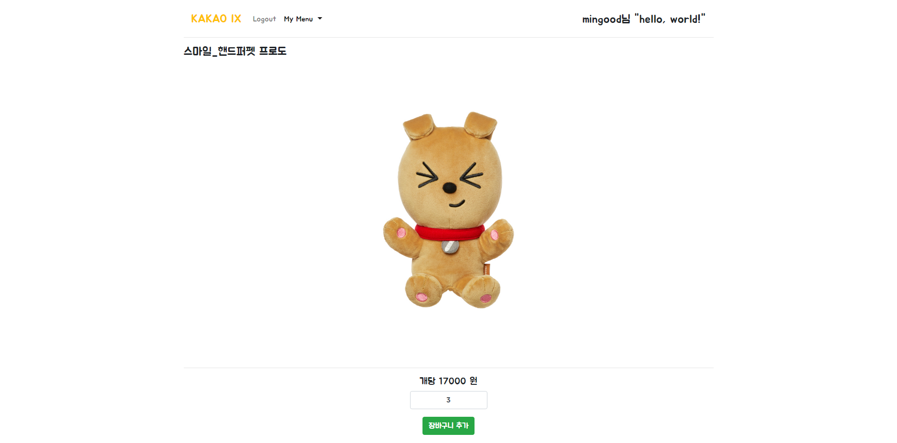

# KakaoIX - Mini Shopping Mall
### 2018 카카오IX 8월 (신입)경력 공채

## API
* [비회원_API](https://github.com/MinGOODdev/KakaoIX-MiniShoppingMall/wiki/1.-RestGuestController)
* [상품_API](https://github.com/MinGOODdev/KakaoIX-MiniShoppingMall/wiki/2.-RestProductController)
* [장바구니_API](https://github.com/MinGOODdev/KakaoIX-MiniShoppingMall/wiki/3.-RestCartController)
* [구매내역_API](https://github.com/MinGOODdev/KakaoIX-MiniShoppingMall/wiki/4.-RestOrderController)

## Run
* mvn package
* war 파일이 있는 경로로 이동
* Cmd 또는 PowerShell 실행
```
java -jar {war_파일명}.war
```
* 웹 브라우저 실행 - localhost:8080

## View

---

---

---

---


## Use
* Spring Boot
* Tomcat
* Security
* JPA
* MySQL (AWS RDS)

## Test
* JUnit
* MockMvc
* Postman & Postman Interceptor

## Author
* 조민국 - [MinGOODdev](https://github.com/MinGOODdev)
